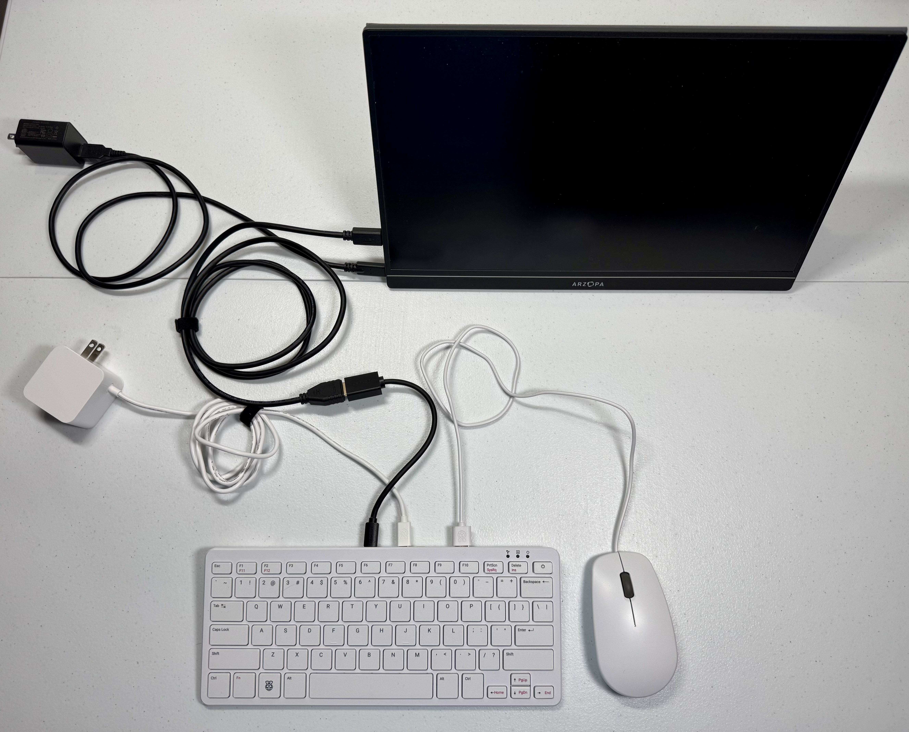
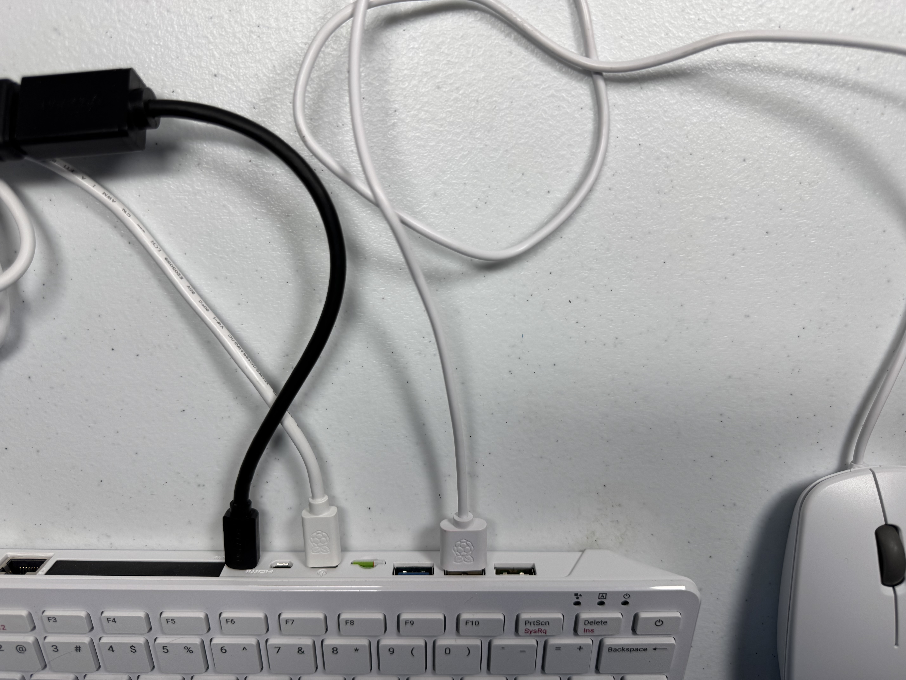
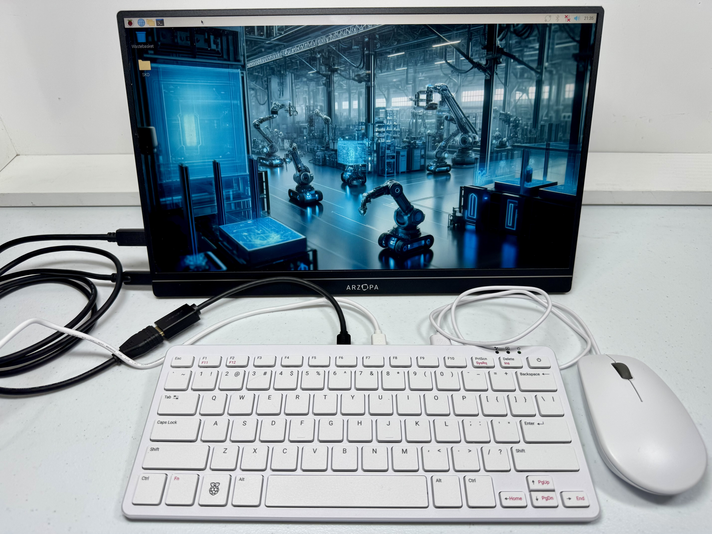
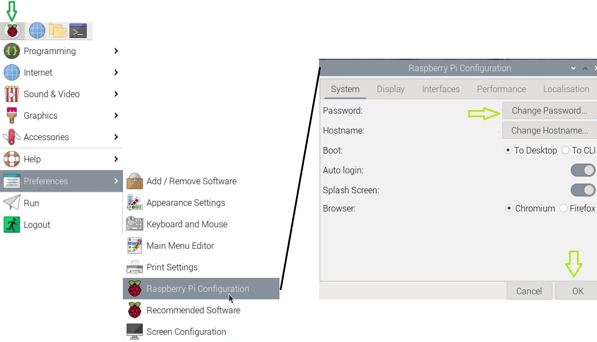
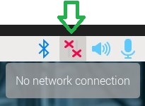
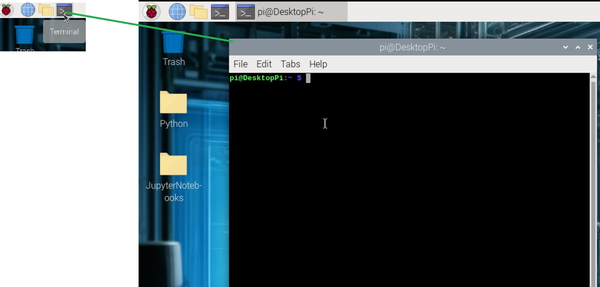

# C1: Pi 500 Setup

**Purpose:** Connect your Pi 500 to a monitor and prepare it as your team's control hub

The Pi 500 is a keyboard computer — the keyboard IS the computer. You just need a monitor and mouse.

Workshop note: the Pi 500 OS image should already be created before the event. Do not run [A1: Pi 500 OS Build](A1_PI500_OS_BUILD.md) during the workshop unless a facilitator tells you to rebuild an SD card.

For a short team-facing checklist, use [Team Start Handout](../handouts/TEAM_START_HANDOUT.md).

---

## Materials Needed

- Full setup BOM: [BILL_OF_MATERIALS.md](BILL_OF_MATERIALS.md)
- Raspberry Pi 500 with SD card already imaged
- Portable monitor
- Micro HDMI to HDMI adapter
- USB mouse
- Power supply (USB-C)

## Photos In This Guide

These images are stored in this repo under `docs/images/pi500/`.

| Photo file | Show |
|------------|------|
| `docs/images/pi500/01_pi500_connection.jpg` | Pi 500 connected to monitor, mouse, and power |
| `docs/images/pi500/02_pi500_connection_closeup.jpg` | Pi 500 connection closeup |
| `docs/images/pi500/03_pi500_boot_desktop.jpg` | Pi 500 after boot |
| `docs/images/pi500/04_pi_config_password.jpg` | Raspberry Pi configuration/password screen |
| `docs/images/pi500/05_wifi_setup.jpg` | WiFi network menu |
| `docs/images/pi500/06_open_terminal.jpg` | Terminal menu location |

## Step 1: Connect Hardware





```
[Monitor] ←HDMI→ [Micro HDMI Adapter] ←→ [Pi 500 HDMI port]
[Mouse] ←USB→ [Pi 500 USB port]
[Power] ←USB-C→ [Pi 500 power port]
```

The Pi 500's keyboard is built-in — no separate keyboard needed.

## Step 2: Power On



1. Plug in power
2. Wait for desktop to appear (~30 seconds)
3. If prompted for password, enter the one set during imaging

If the Raspberry Pi configuration or password screen appears, keep the event hostname as `pihub` and use the password provided for the event.



## Step 3: Connect to WiFi



1. Click the network icon in the top-right taskbar
2. Select your workshop WiFi network
3. Enter password if required
4. Verify: open terminal (Ctrl+Alt+T) and run:
   ```bash
   ping -c 3 google.com
   ```

## Step 4: Open Terminal



You'll use the terminal for everything in this workshop:

- **Menu bar:** Click the terminal icon in the top taskbar
- **Keyboard shortcut:** Ctrl+Alt+T

Practice opening a terminal now. You'll be using it constantly.

## Step 5: Verify VS Code

VS Code should already be installed on the Pi 500 image. This step only verifies that it is ready for event use.

1. Open VS Code:
   ```bash
   code
   ```
2. Verify the required extensions are installed:
   ```bash
   code --list-extensions
   ```
3. Confirm the list includes:
   - `ms-python.python`
   - `ms-vscode-remote.remote-ssh`

If VS Code or either extension is missing, ask a facilitator. Facilitators can use [A1: Pi 500 OS Build](A1_PI500_OS_BUILD.md), Step 6 and Step 7, to repair the image.

The Pi 500 control hub is now ready. You may not be ready to connect to the robot yet. Wait until the robot assembly team has the robot built, powered, and safe to test.

---

## Step 6: Open Workshop Repo

Use the GitHub repo as the main source:

```text
https://github.com/luminerdy/Pathfinder2026
```

Open `docs/workshop/README.md` from the repo page.

Optional: if you cloned the repo locally during image setup, verify it:

```bash
cd ~/Pathfinder2026
ls
```

You should see files like `README.md`, the `docs/` folder, and `docs/workshop/README.md`.

---

## What To Do While The robot Is Still Being Built

- Help the robot assembly team with the checklist.
- Read [C2: robot Pi WiFi Setup](C2_ROBOT_PI_WIFI_SETUP.md) so you know how the robot IP will be found.
- Read [C3: Connect and Test](C3_CONNECT_AND_TEST.md) so you know what will happen after the robot IP is known.
- Open [Student Troubleshooting](../workshop/TROUBLESHOOTING.md) in another browser tab.
- Do not try to SSH into the robot until the robot is powered on and the robot IP is known.

When the robot is assembled and powered on, use [C2: robot Pi WiFi Setup](C2_ROBOT_PI_WIFI_SETUP.md), then [C3: Connect and Test](C3_CONNECT_AND_TEST.md).

---

## Pi 500 Quick Reference

| Action | How |
|--------|-----|
| Open terminal | Ctrl+Alt+T |
| Edit code | `nano filename.py` or use Thonny (GUI editor) |
| Run Python | `python3 script.py` |
| Stop a running script | Ctrl+C |

Robot SSH, file copy, and camera web links start after [C2: robot Pi WiFi Setup](C2_ROBOT_PI_WIFI_SETUP.md), when the robot IP is known.

---

**Next when the robot is ready:** [C2: robot Pi WiFi Setup](C2_ROBOT_PI_WIFI_SETUP.md)
