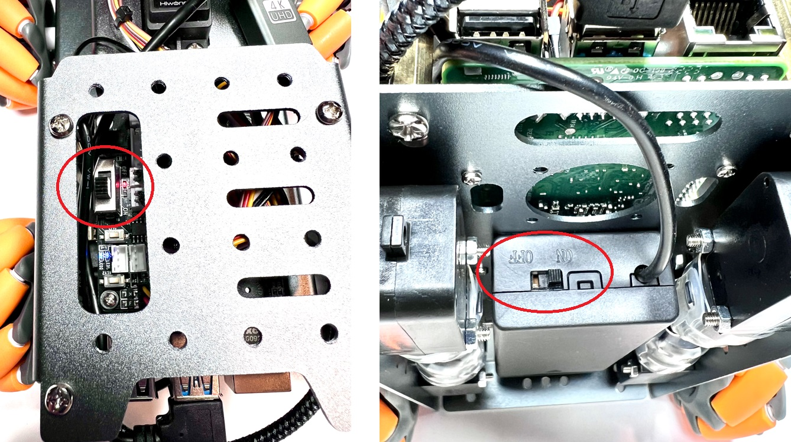
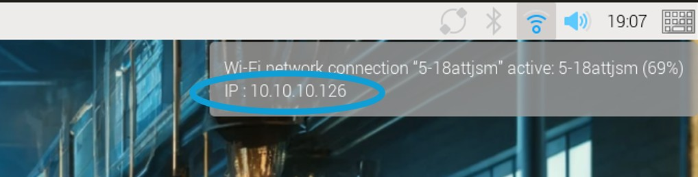

# C2: robot Pi WiFi Setup

**Phase 1: Assemble**

**Purpose:** Power on the assembled robot, connect the robot Pi to the workshop WiFi, and find the robot IP address for C3.

This is an event-time step. The robot SD card image should already be created before the event. Do not run [A2: robot Pi OS Build](A2_ROBOT_PI_OS_BUILD.md) during the workshop unless a facilitator tells you to rebuild a robot SD card.

## Prerequisites

- robot is assembled: [B1 robot Assembly Guide](../workshop/B1_ROBOT_ASSEMBLY_GUIDE.md)
- robot batteries are installed and charged
- Pi 500 is on workshop WiFi: [C1 Pi 500 Setup](C1_PI500_SETUP.md)
- temporary monitor is connected to the robot Pi
- Pi 500 mouse is connected to the robot Pi
- `GuestWifi.pdf` is available on the robot Pi desktop

## Step 1: Connect The robot Pi To A Monitor And Mouse

This step is done on the robot Pi, not on the Pi 500.

1. Connect the temporary monitor to the robot Pi.
2. Move the Pi 500 mouse to the robot Pi.

## Step 2: Power On The robot Safely

**Movement warning:** When the robot powers on, the startup script may move the arm to its startup position. Keep fingers, tools, cables, and loose parts away from the arm, gripper, wheels, and linkages before turning on power.

There are two robot power switches: one on the motor controller and one on the battery container.



1. Put the robot on the floor or a safe test stand.
2. Keep hands clear of wheels, arm joints, and the gripper.
3. Turn on both robot power switches.
4. Wait for the robot Pi to finish booting and for any startup arm movement to stop.

## Step 3: Check The robot Pi Password

If the robot image asks you to change the default password, use the Raspberry Pi Configuration tool.

Open:

```text
Pi menu -> Preferences -> Raspberry Pi Configuration
```

Do not change the hostname during the workshop.


If the robot image does not ask for a password change, continue to Step 4.

## Step 4: Connect The robot Pi To WiFi

Use the Pi 500 mouse to make the WiFi changes on the robot Pi. Use the on-screen keyboard if one appears.

Open `GuestWifi.pdf` from the robot Pi desktop and use the same workshop WiFi instructions used for the Pi 500.

Check the network icon at the top-right of the taskbar. If the network icon looks disconnected, click it and select the correct workshop WiFi network.


Type the WiFi password using the on-screen keyboard if needed.

## Step 5: Find The robot IP

When the robot is connected to WiFi, hover the mouse cursor over the active WiFi icon. Write down the assigned IPv4 address.



Use the workshop network IPv4 address.

Example:

```text
10.10.10.142
```

Do not use:

- `127.0.0.1`
- `169.254.x.x`
- the Pi 500 IP

Write the robot IP on the team handout or a piece of tape near the Pi 500.

## Step 6: Terminal Fallback

If you cannot read the IP from the WiFi icon, open a terminal on the robot Pi and run:

```bash
hostname -I
```

The prompt should look something like:

```text
robot@pathfinder:~ $
```

You may see one or more addresses. Use the workshop network IPv4 address.

## Step 7: If The robot Has No Workshop IP

If the WiFi hover or `hostname -I` returns nothing, or only shows an address that starts with `169.254`, the robot is probably not on the workshop WiFi yet.

Re-check:

- the robot Pi is connected to the correct workshop WiFi
- the WiFi password was typed correctly
- `GuestWifi.pdf` on the robot Pi desktop was followed

If the robot image already has the workshop WiFi saved, rebooting the robot may be enough.

Before rebooting, keep hands clear of the arm and gripper. The startup script may move the arm again after reboot.

```bash
sudo reboot
```

After the robot boots again, repeat Step 5.

## Step 8: Confirm Network From The Pi 500

Move the mouse back to the Pi 500.

On the Pi 500 terminal, run:

```bash
ping <ROBOT_IP>
```

Stop the ping with `Ctrl+C`.

Success means the Pi 500 can see the robot on the workshop network.

If ping fails:

- Confirm you typed the robot IP from Step 5 or Step 6.
- Confirm the Pi 500 is on the workshop WiFi.
- Repeat Step 5 on the robot Pi in case the IP changed.
- Compare with another team before asking a facilitator.

## Step 9: Keep The Team On One Address

Use only the robot IP for:

- SSH
- VS Code Remote SSH
- Web controls

Do not use the Pi 500 IP as a robot connection target.

## Ready For C3 In Phase 1

The team is ready for connect/test when:

- robot is powered on.
- robot Pi is connected to the workshop WiFi.
- robot IP was found from the robot Pi.
- Pi 500 can ping the robot IP.
- Team knows to use `robot@<ROBOT_IP>`.

Next: [C3: Connect and Test](C3_CONNECT_AND_TEST.md)
