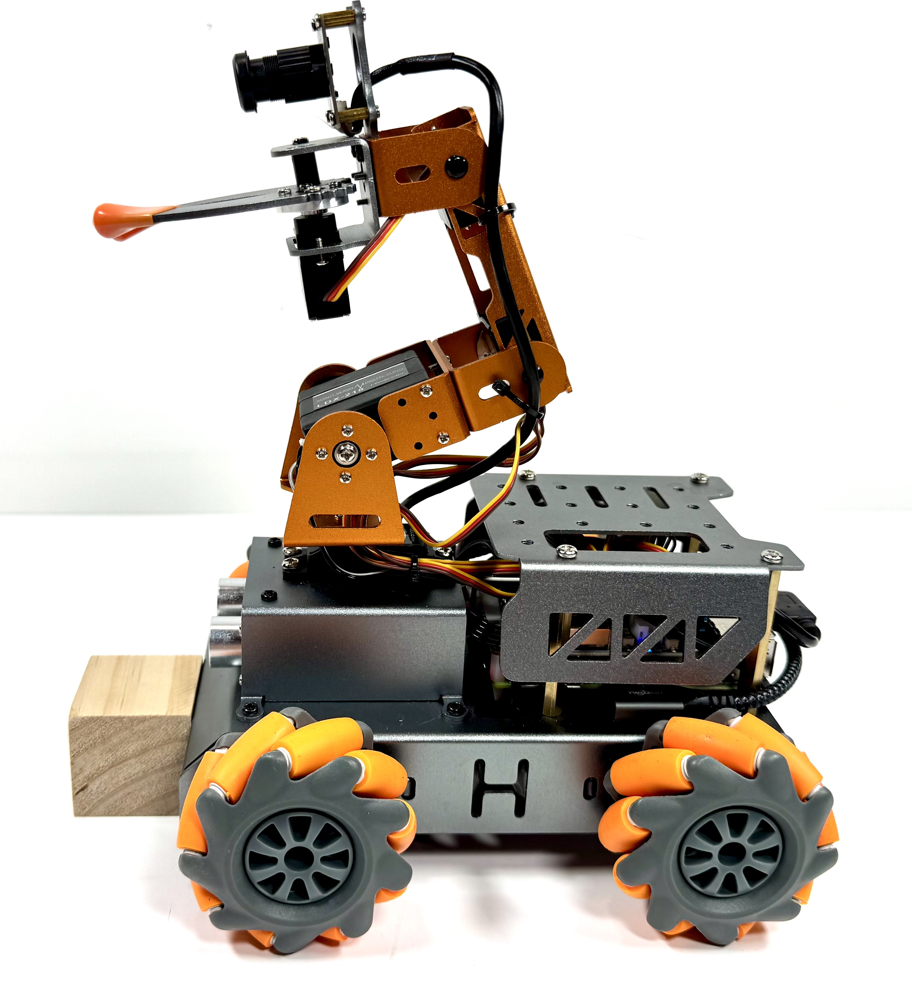
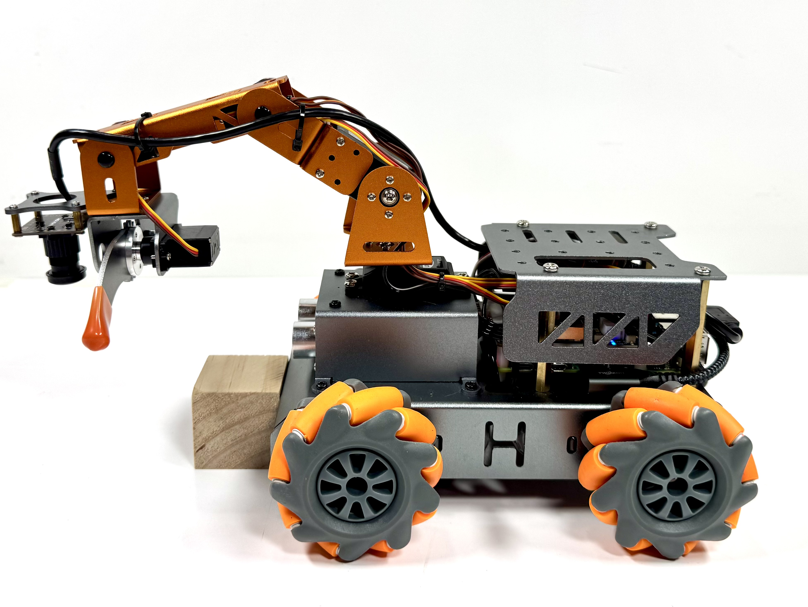
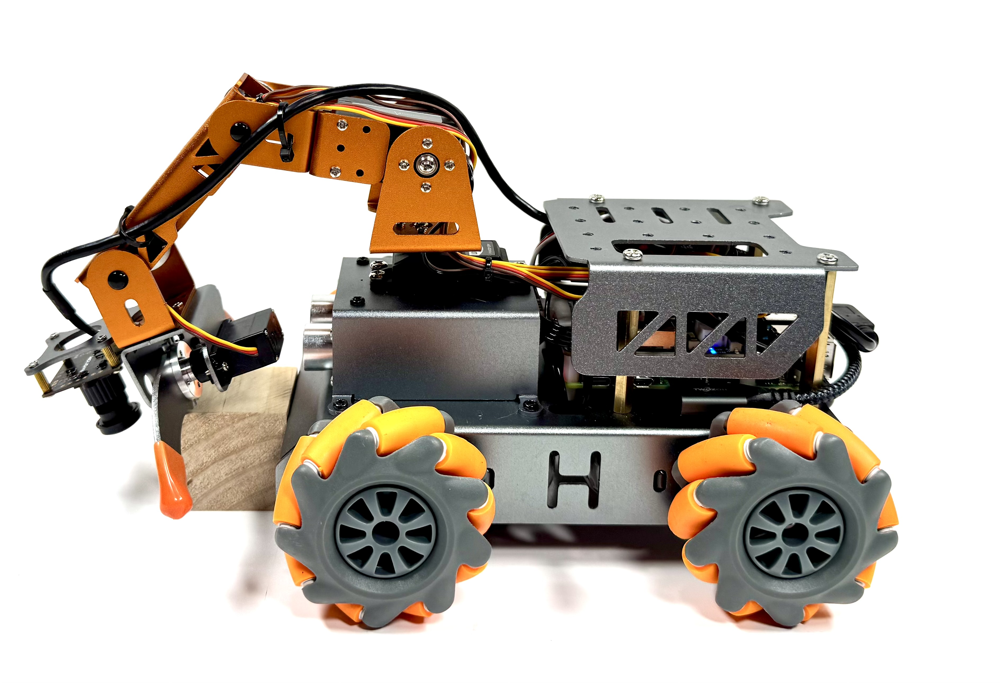
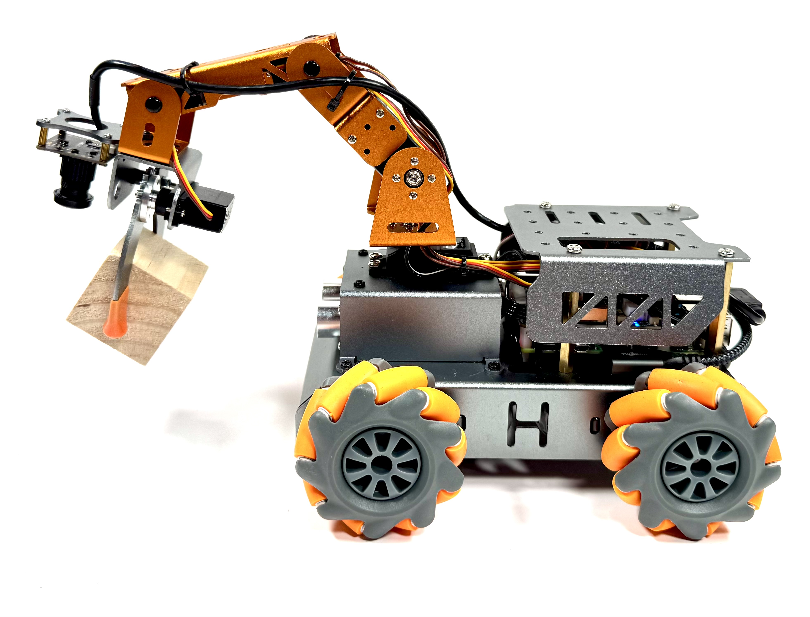
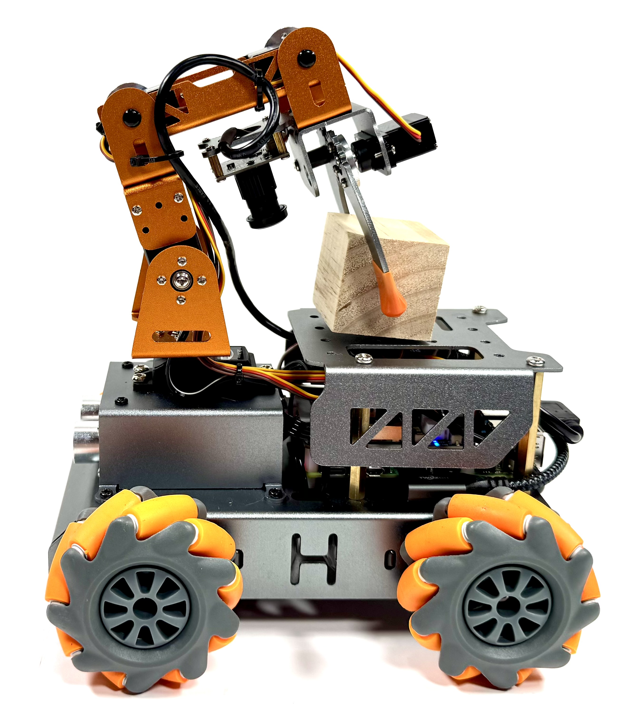
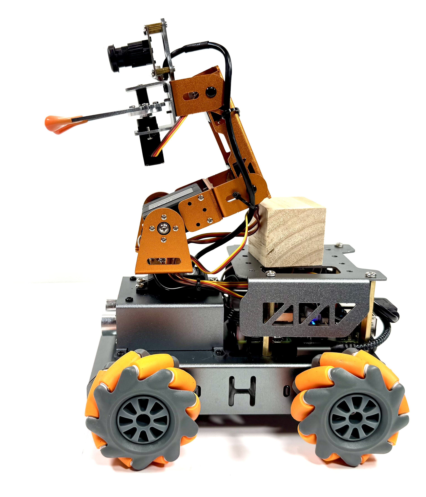

# Capabilities Exploration

**Phase 2 of 3**

Capabilities Exploration is where teams learn how the robot works before they attempt the course.

## Why This Phase Matters

The goal is to understand the code that makes the robot move, sense, see, and use its arm.

Do not treat the demos as magic commands. Run them, observe what the robot does, then open the code and connect the behavior to the file that caused it. That understanding is what lets the team choose a simple strategy for Phase 3.

By the end of this phase, the team should know:

- Which scripts make the robot drive.
- Which scripts read sensors.
- Which scripts use the camera.
- Which scripts move the arm.
- Which settings might need small tuning.

Before changing a demo, read the [Demo Tuning Guide](CONFIG_GUIDE.md).

If something fails, use [Student troubleshooting](../support/TROUBLESHOOTING.md). Compare with another team first. Get help right away if the issue involves wiring, batteries, heat, smoke, broken parts, or `sudo` commands.

## Where To Run Commands

Run these commands while connected to the robot:

```bash
ssh robot@<ROBOT_IP>
cd /home/robot/pathfinder
```

## Before Editing Or Updating Code

During this phase, teams should read code and may make small experiments. Keep the official `/home/robot/pathfinder` repo updateable, and do team edits in `/home/robot/team_code`.

- To edit safely, use [Team code workflow](../support/TEAM_CODE_WORKFLOW.md).
- If a facilitator says new GitHub code is available, use [Update robot code](../support/UPDATE_ROBOT_CODE.md).
- For SSH, copying files, terminals, and connection troubleshooting, use [robot connection reference](../support/ROBOT_CONNECTION_REFERENCE.md).

## Recommended Before Phase 3

Run these demos first. They cover the robot behaviors most teams need before attempting the course.

| Capability | Demo |
|------------|------|
| Mecanum drive | `python3 skills/mecanum_drive/run_demo.py` |
| Sonar sensors | `python3 skills/sonar_sensors/run_demo.py` |
| robotic arm | `python3 skills/robotic_arm/run_demo.py` |

## Recommended Demo Notes

### Mecanum Drive

This demo starts with a standard square pattern, then shows a mecanum square using sideways movement, then shows a diagonal square using diagonal wheel pairs.

**Caution:** The robot will move as soon as the demo starts. Put it on the floor, not on a table. Clear at least a 4-foot by 4-foot area so it can move about 2 feet in any direction.

```bash
python3 skills/mecanum_drive/run_demo.py
```

Watch which functions match each side of each square. If the movement is wrong, go back to Phase 1 motor wiring checks before changing code.

### Sonar Sensors

This demo shows the code that reads distance from the ultrasonic sensor and uses that distance to make simple decisions.

```bash
python3 skills/sonar_sensors/run_demo.py
```

Put your hand or a block in front of the robot and watch the distance readings change. Move the object closer and farther away so the team can see how sensor input becomes numbers in the code.

If the readings do not change, go back to Phase 1 sonar wiring checks before changing code.

### robotic arm pickup

This demo shows the code that moves the arm through a pickup-and-load sequence.

Only run this after Phase 1 servo checks passed. Place the robot on the floor and put one block directly in front of the gripper.

     

```bash
python3 skills/robotic_arm/run_demo.py
```

If any movement is not correct, stop and re-check the arm assembly, block placement, and servo wiring before changing code.

## Manual Control Tools

Use these after the team has explored the individual capability scripts. Manual control is useful for practice, field scouting, and testing strategy, but it should not replace understanding the code that makes each capability work.

| Tool | Guide |
|------|-------|
| Web manual control | [Web Manual Control](WEB_MANUAL_CONTROL.md) |
| Gamepad remote control | [Gamepad Remote Control](GAMEPAD_REMOTE_CONTROL.md) |

## Optional If Time Allows

Use these after the recommended demos are working. These are useful for camera-based and autonomous strategies, but teams should not get stuck here before they have a simple course strategy.

| Capability | Demo |
|------------|------|
| AprilTag navigation | `python3 skills/apriltag_navigation/run_demo.py` |
| Sonar + AprilTag navigation | `python3 skills/sonar_apriltag_navigation/run_demo.py` |
| Line following | `python3 skills/line_following/run_demo.py` |
| Block detection viewer | `python3 skills/block_detection/viewer.py` |
| Block approach | `python3 skills/block_approach/run_demo.py --color blue` |
| Block approach and pickup | `python3 skills/block_approach_pickup/run_demo.py --color blue` |

### Optional Demo Notes

#### AprilTag Navigation

This demo uses the camera to find one of the event AprilTags and drive toward it. The robot looks for the event tag IDs `582`, `583`, `584`, or `585`.

**Caution:** The robot will turn while searching and drive when a tag is found. Put it on the floor, not on a table. Keep the area clear and keep hands away from the wheels.

```bash
python3 skills/apriltag_navigation/run_demo.py
```

Start with the robot about 3 to 5 feet from a printed tag. Good lighting matters. If the robot cannot find a tag, check that the tag is flat, not glossy, and visible to the camera.

See [AprilTag Navigation](../../skills/apriltag_navigation/README.md) for tag IDs and tuning notes.

#### Sonar + AprilTag Navigation

This Area 2 demo uses sonar to clear fixed white cardboard barriers while the camera navigates toward AprilTag `583`.

**Caution:** The robot will drive, strafe, and turn. Put it on the floor, not on a table. Keep hands clear of the wheels, barriers, arm, and claw.

```bash
python3 skills/sonar_apriltag_navigation/run_demo.py
```

This is the published starting tool for the Area 2 sonar route. It is tuned for fixed white cardboard barriers, alternating strafe directions, and a clear camera sightline to AprilTag `583`.

Start with one barrier before testing the full route. If the robot strafes the wrong direction, stop and try:

```bash
python3 skills/sonar_apriltag_navigation/run_demo.py --strafe-direction left
```

See [Sonar + AprilTag Navigation](../../skills/sonar_apriltag_navigation/README.md) for tuning notes.

#### Line Following

This demo follows lime green tape using the camera and mecanum drive. It is useful for testing whether a taped path could become part of the course strategy.

**Caution:** The robot will move as soon as it sees the line. Put it on the floor and keep the path clear.

```bash
python3 skills/line_following/run_demo.py
```

Use lime green tape with good contrast against the floor. Start with a simple straight line before trying curves or obstacles. Press `Ctrl+C` to stop the demo.

See [Line Following](../../skills/line_following/README.md) for detection and tuning notes.

#### Block Detection Viewer

Use the viewer to see what the robot camera can identify before trying to move toward a block.

```bash
python3 skills/block_detection/viewer.py
```

From the Pi 500 browser, open:

```text
http://<ROBOT_IP>:8081
```

The viewer can filter for red, blue, and yellow blocks. The green box shows the selected target. The arm controls can move the camera angle, but this viewer does not drive the robot base.

See [Block Detection](../../skills/block_detection/README.md) for snapshot and tuning notes.

#### Block Approach

This demo uses the camera to select one block color, center the robot, and drive close to the block. It does not grab the block.

**Caution:** The robot will move as soon as the target is found. Put it on the floor, not on a table. Clear at least a 4-foot by 4-foot area and keep hands clear of the wheels, arm, and claw.

```bash
python3 skills/block_approach/run_demo.py --color blue
```

Change `blue` to `red` or `yellow` to test a different target color. Press `Ctrl+C` to stop the demo.

See [Block Approach](../../skills/block_approach/README.md) for behavior notes and color options.

#### Block Approach And Pickup

This experimental demo combines block detection, approach, and the front pickup arm sequence. It is a starting tool for teams that want to explore autonomous pickup, not a complete course solution.

**Caution:** The robot will drive and move the arm. Put it on the floor, not on a table. Keep hands clear of the wheels, arm, and claw.

```bash
python3 skills/block_approach_pickup/run_demo.py --color blue
```

Change `blue` to `red` or `yellow` to test a different target color. Use a fresh battery before judging whether movement tuning is good enough.

See [Block Approach And Pickup](../../skills/block_approach_pickup/README.md) for behavior notes and tuning options.

## Team Notes

For each capability, teams should record:

- What worked immediately
- What needed tuning
- What failed
- Which settings changed
- Whether the capability is reliable enough for the course
- Which capability the team will actually use in the course

## Phase 2 Complete

The team is ready for Phase 3: Course Challenge when:

- The robot can drive forward, strafe, and turn.
- The team can stop the robot quickly.
- Battery checks are routine.
- Camera hardware has been tested.
- Optional vision tools have been tested in event lighting if the team plans to use them.
- The team has a basic pickup or storage strategy.
- The team has selected a navigation strategy.

## Next Phase

Continue to [Phase 3: Course Challenge](COURSE_CHALLENGE.md).
